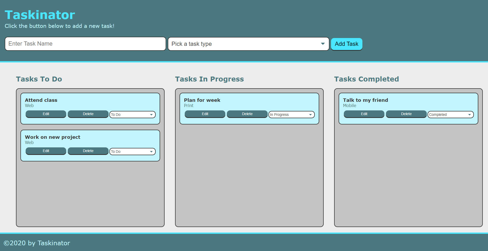

# taskinator

This project creates a task-tracker application called the Taskinator. Using this tool, you will be able to create tasks by entering a task name, selecting a type, and clicking an "Add Task" button. You can also organize the tasks into "Tasks To Do", "Tasks In Progress", and "Tasks Completed" lists by using the dropdown to change the task status.

## Task List

- [x] Use JavaScript to dynamically update HTML and CSS.
- [x] Create clean, polished and responsive user interface.
- [x] Use DOM API methods to handle button clicks.
- [x] Store task items in organized lists using an array of objects.
- [x] Sync the data with the display in the browser.
- [x] Save data using localStorage, and serialize and de-serialize the data using JSON.stringify() and JSON.parse().

## Tech/framework used
* HTML
* CSS
* JavaScript

## User Story

As a user, I would like to have a tool for organizing and tracking my tasks. I would like to add, remove and modify tasks and classify them based on three groups "Tasks To Do", "Tasks In Progress", and "Tasks Completed".

## Acceptance Criteria

* When I enter a task name, select the task type and click on "Add Task" button, then the new task is added under the "Tasks To Do" list.
* When I click on "Edit" button, then the task information appears on the form and I should be able to modify and save them using "Save Task" button.
* I should be able to change a task group by using the drop-down menu next to it.
* I should be able to delete a task by clicking on "Delete" button.

## Link to Deployed Application
https://sshahram.github.io/taskinator/

## Link to Github Repository
https://github.com/sshahram/taskinator

## Screenshot
The following screenshot shows how this application looks like:

